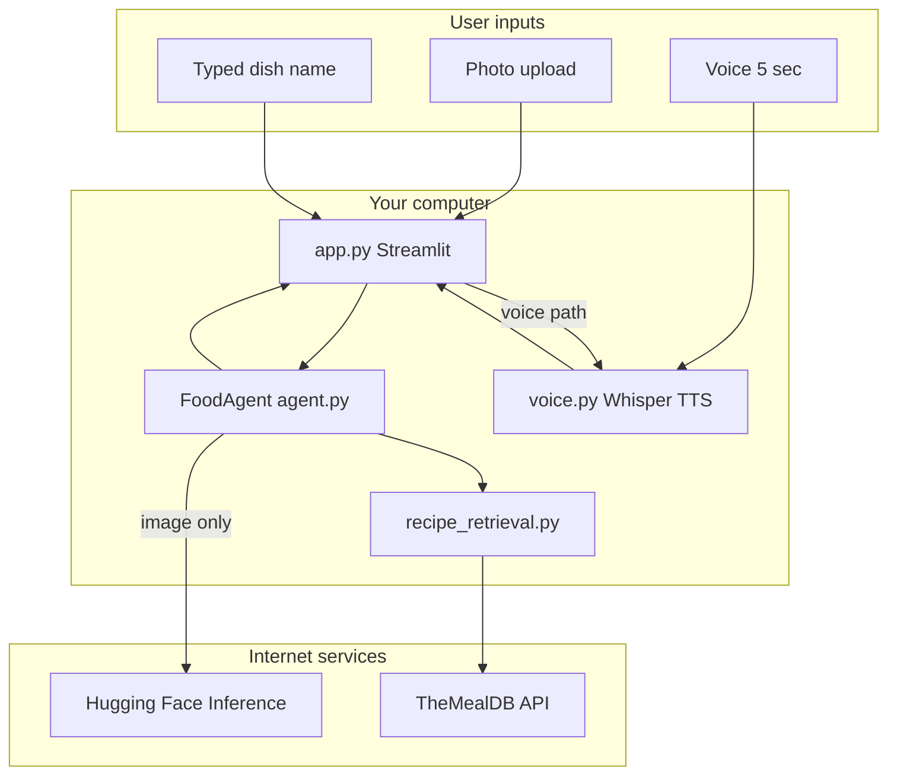
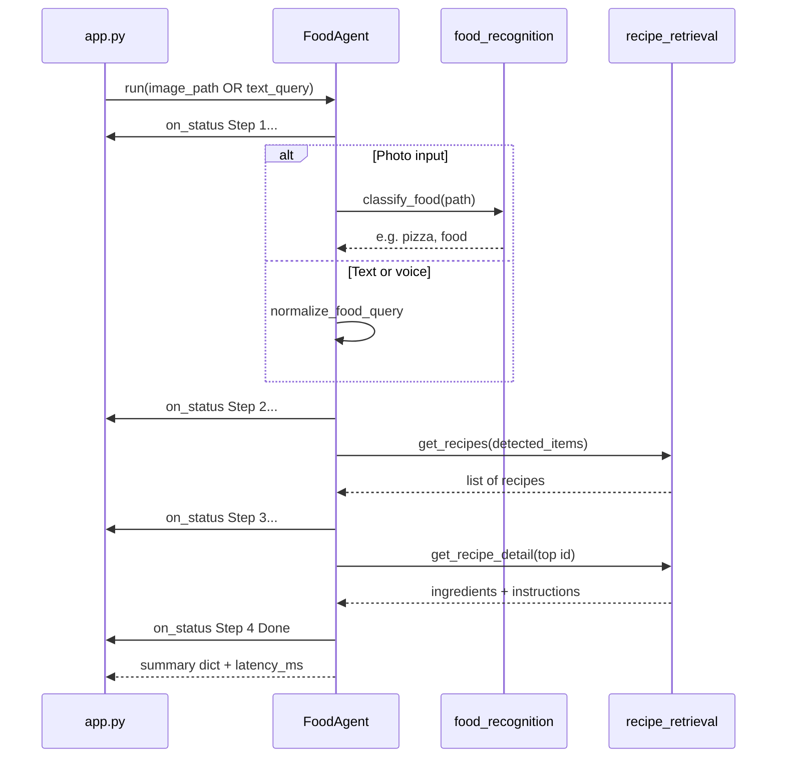
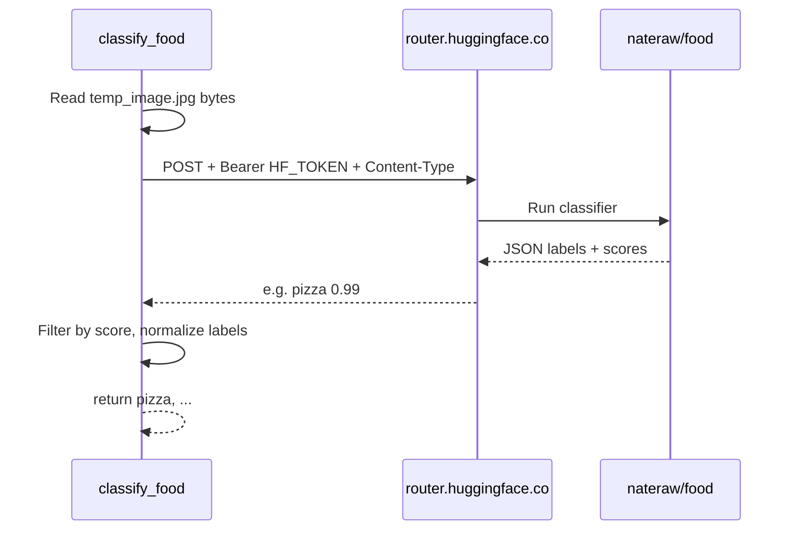

# CWM — How It Works

**Cook With Me (CWM)** is a multimodal food app: you can **upload a photo**, **type a dish name**, or **speak a search**, and it returns **recipes** with ingredients and cooking steps. This document explains the architecture, every major module, how **Hugging Face** fits in, and how data flows through the system.

---

## Table of contents

1. [Big picture](#big-picture)
2. [External services](#external-services)
3. [Project structure](#project-structure)
4. [Three ways to search](#three-ways-to-search)
5. [The FoodAgent pipeline](#the-foodagent-pipeline)
6. [Module reference](#module-reference)
7. [Hugging Face in depth](#hugging-face-in-depth)
8. [Configuration (`.env`)](#configuration-env)
9. [Optional components](#optional-components)
10. [Limitations](#limitations)

---

## Big picture

CWM is not one AI model. It is a **pipeline** that chains specialized pieces:

| Layer | Technology | Runs where |
|-------|------------|------------|
| **Photo understanding** | Hugging Face Inference (`nateraw/food`) | Hugging Face cloud |
| **Voice input** | OpenAI Whisper (local) | Your PC |
| **Voice output** | pyttsx3 (local) | Your PC |
| **Recipes** | TheMealDB API | TheMealDB servers |
| **Orchestration** | `FoodAgent` (Python) | Your PC |
| **User interface** | Streamlit | Your PC |



**Important:** Text and voice searches **never** call Hugging Face. Only the **photo** path uses HF vision.

---

## External services

### Hugging Face (photo detection only)

- **What it does:** Classifies food in an image (Food-101 style labels: pizza, sushi, etc.).
- **What you need:** A free account and an access token in `.env` as `HF_TOKEN`.
- **Billing:** Separate from Google Cloud. Uses HF’s free inference tier (with rate limits). No GCP credit card required for this path.

### TheMealDB (all recipe results)

- **What it does:** Free recipe database API (titles, images, ingredients, instructions).
- **What you need:** Nothing—no API key.
- **Limitation:** Small catalog (~hundreds of meals). Dishes like “jollof rice” may not exist even when photo detection works.

### OpenAI Whisper (voice input only)

- **What it does:** Speech-to-text on your microphone recording.
- **Runs locally** on your machine (not the OpenAI API). First run downloads the `base` model (~140 MB).

### pyttsx3 (voice output only)

- **What it does:** Speaks a short summary after a successful voice search.
- **Runs locally** using your system’s text-to-speech voices.

---

## Project structure

```
cwm/
├── app.py                 # Streamlit UI (main entry point)
├── agent.py               # FoodAgent — 4-step orchestration
├── food_recognition.py    # Hugging Face photo classification
├── recipe_retrieval.py    # TheMealDB search + detail
├── voice.py               # Whisper ASR + pyttsx3 TTS
├── food_image_detection.py  # Optional CLI: screenshot → detect
├── .env                   # Secrets (HF_TOKEN) — not committed
├── .env.example           # Template for .env
├── requirements.txt       # Python dependencies
├── tests/test_cwm.py      # Automated tests
├── backend/               # Optional Go REST API (separate stack)
└── mobile-branch/         # Optional React Native client
```

**Run the app:**

```bash
python -m streamlit run app.py
```

---

## Three ways to search

All three paths end in the same **`FoodAgent.run()`** pipeline (except voice adds TTS at the end).

| Input | Step before agent | Agent mode | Uses Hugging Face? |
|-------|-------------------|------------|------------------|
| **Photo** | Save `temp_image.jpg`, click Detect | `image_path=...` | **Yes** — `classify_food()` |
| **Type** | Click “Find recipes” | `text_query=...` | No |
| **Voice** | Record 5s → Whisper → text | `text_query=...` | No |

**Priority on one screen refresh:** typed search beats voice beats photo detect (Streamlit `if / elif` chain in `app.py`).

### Photo path (detail)

1. User uploads JPG/PNG/WebP.
2. `resize_image()` / `_to_rgb()` prepare the file; preview is shrunk for UI only.
3. Full image saved as `temp_image.jpg`.
4. `FoodAgent` calls `classify_food(temp_image.jpg)` → **Hugging Face**.
5. Labels (e.g. `pizza`) → `get_recipes()` → TheMealDB.
6. UI shows tags, latency, recipe cards.

### Text path (detail)

1. User types e.g. `pizza` or `Can you get me the recipe for pasta`.
2. `normalize_food_query()` strips filler words → `pasta`.
3. Agent uses that string directly as the food term (no HF).

### Voice path (detail)

1. `record_audio(5)` captures microphone → temporary WAV.
2. `transcribe_audio()` runs **local Whisper**.
3. `normalize_food_query()` cleans the phrase.
4. Same as text path through the agent.
5. `speak_recipe_summary()` reads results aloud via **pyttsx3**.

---

## The FoodAgent pipeline

`FoodAgent` in [`agent.py`](agent.py) is the **agentic loop**: one entry point that runs detect → recipes → top-recipe detail and returns a structured result.



### `FoodAgent.run()` parameters

| Parameter | Type | Purpose |
|-----------|------|---------|
| `image_path` | `str \| None` | Path to image for HF classification |
| `text_query` | `str \| None` | Dish name from keyboard or voice |
| `on_status` | callback | Updates Streamlit status log (Step 1–4) |

Exactly **one** of `image_path` or `text_query` must be set.

### Success return value

| Key | Meaning |
|-----|---------|
| `detected_items` | List of food strings used for search |
| `recipes_found` | Up to 5 recipe dicts (`title`, `url`, `thumbnail`, `id`) |
| `top_recipe_title` | Name of the best match |
| `top_recipe_ingredients` | List of strings |
| `top_recipe_instructions` | Truncated to 500 characters |
| `latency_ms` | Total pipeline time in milliseconds |

### Error codes

| `error` | Meaning |
|---------|---------|
| `step0_input` | Both or neither of image/text provided |
| `step1_detection` | HF returned no labels (photo path) |
| `step2_recipes` | TheMealDB had no meals for those terms |
| `step3_detail` | Could not load full detail for top recipe |

---

## Module reference

### [`app.py`](app.py) — Streamlit frontend

| Function | What it does |
|----------|----------------|
| `_to_rgb()` | Converts PNG/RGBA images to RGB so JPEG save works |
| `make_preview()` | Smaller image for UI so the page does not require excessive scrolling |
| `resize_image()` | Thumbnails upload to max 1024px; returns bytes for display |
| `_update_status()` | Writes agent step text into the live status box |
| `_run_agent()` | Creates `FoodAgent`, wires `on_status` to the UI |
| `_display_agent_result()` | Shows errors, food tags, metrics, chef’s pick, recipe grid |
| `_render_recipes()` | Recipe cards; “Full details” calls `get_recipe_detail()` per meal |

Also configures page layout, sidebar (HF token status), and handles the three input branches.

---

### [`agent.py`](agent.py) — FoodAgent

| Name | What it does |
|------|----------------|
| `FoodAgent` | Class wrapping the multi-step pipeline |
| `FoodAgent.run()` | Main method — see [FoodAgent pipeline](#the-foodagent-pipeline) |
| `STATUS_STEP1` … `STATUS_STEP4` | Fixed strings for UI status log |

**Imports:** `classify_food` from `food_recognition`, `get_recipes`, `get_recipe_detail`, `normalize_food_query` from `recipe_retrieval`.

---

### [`food_recognition.py`](food_recognition.py) — Hugging Face vision

| Function | What it does |
|----------|----------------|
| `_load_env_file()` | Parses `.env` into `os.environ` if `python-dotenv` is missing |
| `_bootstrap_env()` | Loads `.env` on import (dotenv or fallback parser) |
| `get_hf_token()` | Reads `HF_TOKEN` or `HUGGINGFACE_API_KEY` |
| `get_hf_model()` | Reads `HF_VISION_MODEL` (default `nateraw/food`) |
| `vision_is_configured()` | `True` if a token is present — used by sidebar |
| `_guess_content_type()` | Sets `image/jpeg`, `image/png`, etc. for HF router API |
| `_normalize_label()` | `fried_rice` → `fried rice` |
| `_parse_hf_predictions()` | Converts HF JSON `[{label, score}, ...]` to string list |
| `_classify_with_hf()` | HTTP POST image to HF router; retries once on 503 |
| **`classify_food()`** | **Public API** — returns `list[str]` food labels or `[]` on failure |

---

### [`recipe_retrieval.py`](recipe_retrieval.py) — TheMealDB

| Function | What it does |
|----------|----------------|
| `normalize_food_query()` | Strips phrases like “recipe for” from voice/text |
| `_meals_to_recipes()` | Maps MealDB rows to `{title, url, thumbnail, id}` |
| `_fetch_meals_by_name()` | `search.php?s=` — **dish name** (works for pizza, fried rice) |
| `_fetch_meals_by_ingredient()` | `filter.php?i=` — fallback by ingredient |
| **`get_recipes()`** | Tries name search, then ingredient; dedupes; max 5 results |
| **`get_recipe_detail()`** | Full meal by ID — ingredients, instructions, YouTube link |

---

### [`voice.py`](voice.py) — Local voice I/O

| Function | What it does |
|----------|----------------|
| `get_whisper_model()` | Loads Whisper `base` model (cached in Streamlit) |
| **`record_audio()`** | Records 5 seconds from mic → temp WAV file |
| **`transcribe_audio()`** | Whisper speech-to-text |
| **`speak_recipe_summary()`** | TTS: “I found N recipes for X. The top result is Y.” |

Uses optional imports with clear errors if `sounddevice`, `whisper`, or `pyttsx3` are missing.

---

### [`food_image_detection.py`](food_image_detection.py) — CLI utility

| Function | What it does |
|----------|----------------|
| `capture_screen()` | Screenshot via `pyautogui` |
| `save_frame()` | Writes `detected_image.jpg` |
| `print_recipes()` | Console output |
| `main()` | Screen → `classify_food` → `get_recipes` (uses HF if token set) |

Run: `python food_image_detection.py`

---

### [`tests/test_cwm.py`](tests/test_cwm.py)

Pytest suite mocking HF, MealDB, and agent steps. Run: `pytest tests/ -v`

---

## Hugging Face in depth

### What Hugging Face is (for this project)

Hugging Face is a platform for **machine learning models**. CWM does **not** train models. It **calls** a pre-trained model hosted by Hugging Face:

- **Model:** [`nateraw/food`](https://huggingface.co/nateraw/food)
- **Task:** Image classification (which food category is in the photo?)
- **Training data:** Food-101 (101 food types)

### What you set up on huggingface.co

1. **Create an account** (free).
2. **Create an access token:** [Settings → Access Tokens](https://huggingface.co/settings/tokens)  
   - **Read** access is enough.  
   - Copy the token (`hf_...`) into `.env` as `HF_TOKEN=...`
3. You typically **do not** need to:
   - Deploy a private Inference Endpoint (paid)
   - Download the model to your PC
   - Enable Google Cloud APIs

### What happens on each photo detect



**API endpoint (current):**

```
POST https://router.huggingface.co/hf-inference/models/nateraw/food
Headers:
  Authorization: Bearer <HF_TOKEN>
  Content-Type: image/jpeg   (or png/webp)
Body: raw image bytes
```

**Example response:**

```json
[
  {"label": "pizza", "score": 0.996},
  {"label": "bruschetta", "score": 0.0005}
]
```

The code keeps labels with **score ≥ 0.05**, up to **5** labels, and converts underscores to spaces.

### Cold start and errors

| Situation | Behavior |
|-----------|----------|
| Model asleep | HTTP **503** — code waits 15s and retries once |
| Missing token | Empty list → agent `step1_detection` |
| Wrong/old API URL | 404 — fixed by using `router.huggingface.co` |
| Rate limit | HTTP 429 — wait or upgrade HF plan |

### HF vs Google Cloud Vision (historical)

The project **used** Google Cloud Vision; it now uses **HF Inference** for the Streamlit app so you avoid GCP billing. The optional **Go backend** (`backend/main.go`) may still reference Google’s client if you use that API separately.

### Privacy note

Photo bytes are sent to **Hugging Face’s servers** for classification. Voice with Whisper runs **locally** and does not send audio to HF.

---

## Configuration (`.env`)

| Variable | Required | Purpose |
|----------|----------|---------|
| `HF_TOKEN` | For photo detect | Hugging Face access token |
| `HF_VISION_MODEL` | No | Default `nateraw/food` |
| `HUGGINGFACE_API_KEY` | Alternative name | Same as `HF_TOKEN` |

Example:

```env
HF_TOKEN=hf_your_token_here
HF_VISION_MODEL=nateraw/food
```

`.env` is listed in `.gitignore` — never commit it.

---

## Optional components

### Go backend (`backend/main.go`)

REST API on port 4000 for mobile clients. Uses Google Cloud Vision in the original design—not wired to HF unless you change it.

### React Native (`mobile-branch/`)

Expo app that talks to the Go API.

### Streamlit vs CLI

| Entry | Command |
|-------|---------|
| Web UI | `streamlit run app.py` |
| Screen capture | `python food_image_detection.py` |

---

## Limitations

1. **TheMealDB size** — Many real-world dishes are not in the database.
2. **Food-101 labels** — HF returns coarse categories; not every cuisine or dish name.
3. **HF free tier** — Rate limits and occasional slow first request.
4. **Voice** — Works best with short dish names, not long sentences.
5. **No conversation memory** — Each search is independent; `FoodAgent` is a fixed 4-step script, not a chat LLM.

---

## Quick troubleshooting

| Symptom | Check |
|---------|--------|
| Sidebar: photo not configured | `HF_TOKEN` in `.env`, restart Streamlit |
| Photo detect fails | Token valid; wait for model load; try typed search |
| No recipes but labels show | TheMealDB has no meal for that name — try another dish |
| Voice fails | `pip install openai-whisper sounddevice scipy pyttsx3` |
| 404 on HF | Ensure `food_recognition.py` uses `router.huggingface.co` URL |

---

## Summary

CWM combines **Hugging Face** (photo labels), **TheMealDB** (recipes), **Whisper** (voice in), and **FoodAgent** (orchestration) behind one Streamlit UI. Hugging Face is only the **eyes** for uploaded photos; everything else either runs locally or calls the free recipe API. Your main setup task is a single **`HF_TOKEN`** in `.env` for photo search to work.
